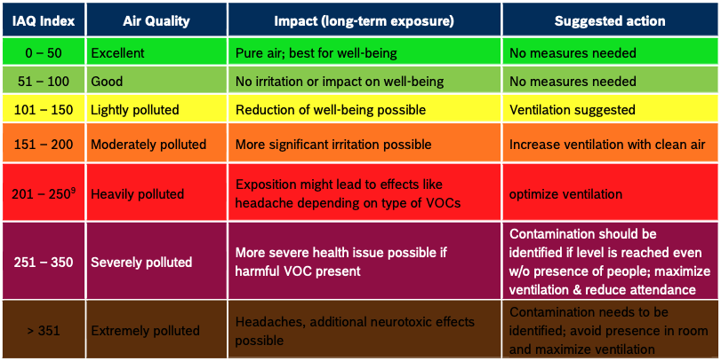
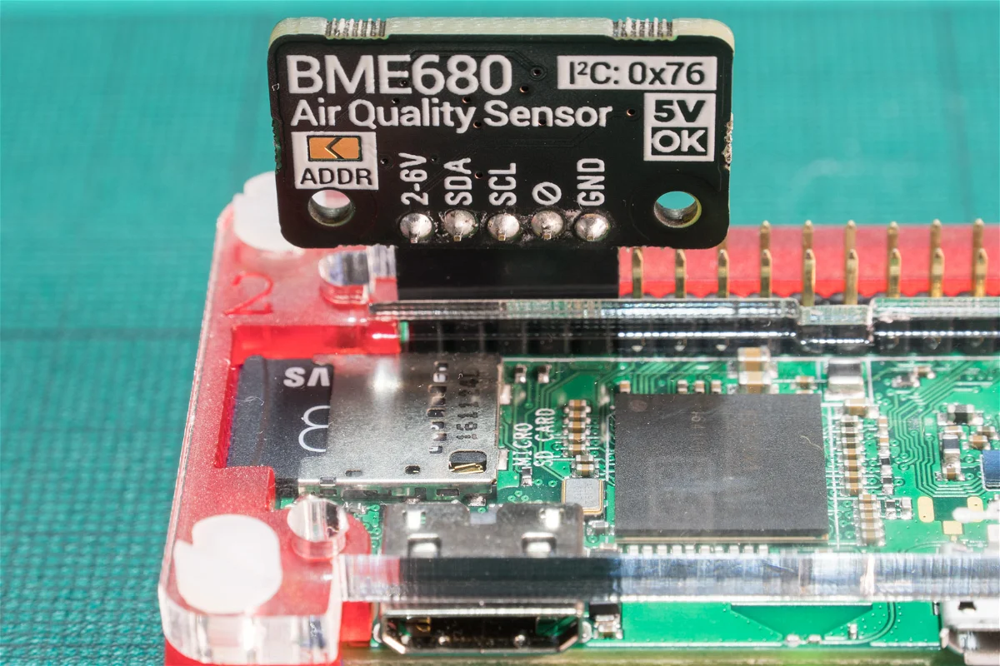

# MMM-BME680

THIS IS A FORK IN DEVELOPMENT!!! CODE NOT TESTED

This is an extension for the [MagicMirror²](https://github.com/MichMich/MagicMirror). It monitors temperature, humidity, air pressure and gas levels from [BME-680 sensor](https://www.bosch-sensortec.com/products/environmental-sensors/gas-sensors/bme680/). The BME-680 produces data within the following ranges:

- Pressure: 300-1100 hPa
- Humidity: 0-100%
- Temperature: -40-85°C 
- Index for Air Quality (IAQ) targeting breath Volitile Organic Compunds (b-VOC): 0-500 (+/-15% sensor-to-sensor variation)



## Installation
1. Navigate into your MagicMirror's `modules` folder.
2. Clone repository `git clone https://github.com/samwaugh/MMM-BME680`.
3. Go to newly created directory (`cd MMM-BME680`).
4. Execute `npm install` to install the node dependencies.
5. Connect the BME680 to your Raspberry Pi.

### Hardware
The particular board that this was tested with is the [Pimoroni breakout](https://learn.pimoroni.com/article/getting-started-with-bme680-breakout), older  than the current [BME-680](https://shop.pimoroni.com/products/bme680-breakout?variant=12491552129107) and the [BME-688](https://shop.pimoroni.com/products/bme688-breakout?variant=39336951709779). This can be connected directly to pins 1-5 on the 40-pin RPi GPIO.




## Using the module


Add it to the modules array in the `config/config.js` file:

````javascript
modules: [
	...
	{
		module: 'MMM-BME680',
		position: 'top_left',
		config: {
			updateInterval: 5 //seconds
			}
	},
	...
]
````

## Configuration options

Configurations properties

<table width="100%">
	<thead>
		<tr>
			<th>Property</th>
			<th width="100%">Description</th>
		</tr>
	<thead>
	<tbody>
		<tr>
			<td><code>titleText</code></td>
			<td>Widget title text
				<br><b>Type:</b> <code>string</code>
				<br><b>Default:</b> <code>Home weather</code>
			</td>
		</tr>
		<tr>
			<td><code>updateInterval</code></td>
			<td>Wait interval between readings of BME680 sensor values in seconds
				<br><b>Type:</b> <code>int</code>
				<br><b>Default:</b> <code>100</code>
			</td>
		</tr>
		<tr>
			<td><code>deviceAddress</code></td>
			<td>BME680 I2C address, default is 0x76
				<br><b>Type:</b> <code>hex string</code>
				<br><b>Default:</b> <code>"0x76"</code>
			</td>
		</tr>
		<tr>
			<td><code>temperatureScaleType</code></td>
			<td>Different temperature scales
				<br><b>Type:</b> <code>int</code>
				<br><b>Default:</b> <code>0</code>
				<br><b>Scale types:</b> <code>0</code> Celsius, <code>1</code> Fahrenheit
			</td>
		</tr>
		<tr>
			<td><code>pressureScaleType</code></td>
			<td>Different pressure scales
				<br><b>Type:</b> <code>int</code>
				<br><b>Default:</b> <code>0</code>
				<br><b>Scale types:</b> <code>0</code> hPa, <code>1</code> inHg
			</td>
		</tr>
	</tbody>
</table>

## Additional Mirror Projects of Interest

- [MMM-BME280](https://github.com/awitwicki/MMM-BME280) for temperature, humidity and pressure (from which this project was forked, many thanks!).
- [MMM-MHZ19](https://github.com/awitwicki/MMM-MHZ19) using [MHZ-19](https://revspace.nl/MHZ19) CO2 sensor.
- [MMM-DHT-Sensor](https://github.com/bernardpletikosa/MMM-DHT-Sensor) (fork grandparent!) and [MMM-LocalTemperature](https://github.com/glitch452/MMM-LocalTemperature) temperature and humidity using Adafruit DHT11, DHT22, or AM2302 sensors.
- [MMM-01ZM](https://github.com/rubinho101/MMM-01ZM) Xiaomi LYWSDCGQ 01ZM Temperature-Humidity AND [Nova PM SDS011](https://microcontrollerslab.com/nova-pm-sds011-dust-sensor-pinout-working-interfacing-datasheet/) dust partical sensors.

## Code Information
### Dependencies
- `python3` (should be installed on Raspberry Pi)
- `smbus` (Python library, install via `pip3 install smbus` )

### Developer Notes
For more details about BCM pin numbers check [here](http://www.raspberrypi-spy.co.uk/2012/06/simple-guide-to-the-rpi-gpio-header-and-pins)

### Test BME680 module
1. Navigate into your `MagicMirror/modules/MMM-BME680` folder
2. Run script `python3 bme680.py <"optional I2C address">`
   - If you get `FileNotFoundError: [Errno 2] No such file or directory` you have to enable i2c interface (`raspi-config nonint do_i2c 0`)
   - If script prints `OSError: [Errno 121] Remote I/O error` then you are using wrong I2C address. Try to run `i2cdetect -y 1` console command to find out your device address.
3. Script should print sensor values like this `24.7 38.3 996.6` - that means `temperature humidity pressure`
   - If you only see `0 0 0` make sure you are not setting the PINs you are using in another program. 

### Code Sources

- [MMM-BME280](https://github.com/awitwicki/MMM-BME280)
- [Using the BME280 I2C Temperature and Pressure Sensor in Python](https://www.raspberrypi-spy.co.uk/2016/07/using-bme280-i2c-temperature-pressure-sensor-in-python/)
- [Borsch BME68x Sensor API](https://github.com/BoschSensortec/BME68x-Sensor-API)

