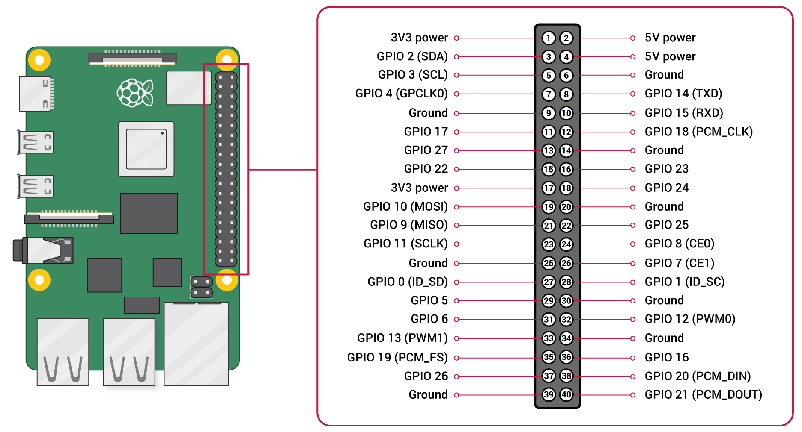
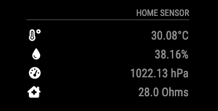

# MMM-BME680

This is an extension for the [MagicMirror²](https://github.com/MichMich/MagicMirror). It monitors temperature, humidity, air pressure and gas levels from [BME-680 sensor](https://www.bosch-sensortec.com/products/environmental-sensors/gas-sensors/bme680/), and should work with the BME-688 as well. The BME-680 produces data within the following ranges:

- Pressure: 300-1100 hPa.
- Humidity: 0-100%.
- Temperature: -40-85°C.
- Air quality: measure of breath Volitile Organic Compounds (b-VOC) noting a +/-15% sensor-to-sensor variation.

Bosch provide propriety code for converting to the Index for Air Quality (IAQ), which requires licencing of their software. This project attempts to callibrate the sensor using [thstielow's](https://github.com/thstielow/raspi-bme680-iaq) reverse engineering of the IAQ calculations. This provides an estimate of b-VOC, which should be sufficient as an indication of IAQ. (No responsibility is taken for anyone relying on this in dangerous environments, as this is simply a hobby project.)

This project is in development: currently I need to make sure that the logging that is used for the IAQ calculation works when the sensor update is being called at different time periods.

## Hardware
The particular board that this was tested with is the [Pimoroni breakout](https://learn.pimoroni.com/article/getting-started-with-bme680-breakout), older  than the current [BME-680](https://shop.pimoroni.com/products/bme680-breakout?variant=12491552129107) and the [BME-688](https://shop.pimoroni.com/products/bme688-breakout?variant=39336951709779). This can be connected directly to pins 1, 3, 5, 7 and 9 on the 40-pin RPi GPIO. This also assumes I2C is enabled on the RPi. (It is not recommended to have the sensor so close to the Pi board, given the potential for heat generation.) For completeness, the following three images should assist in locating the board on the correct pins:




## Module Details

Note that this is an old picture. The intent is to update when the IAQ calculations are working correctly, and to add colour coding to the IAQ field to highlight poor air quality.

### Installation
0. Connect your BME68x hardware to your Raspberry Pi, including initiation of I2C functionality.
1. Install the [Pimoroni BME68x Python Library](https://github.com/pimoroni/bme680-python).
2. Navigate into your MagicMirror's `modules` folder.
3. Clone repository `git clone https://github.com/samwaugh/MMM-BME680.git`.
4. Go to newly created directory (`cd MMM-BME680`).
5. Execute `npm install` to install the node dependencies.

### Updating
1. Go to the extension directory (`cd ~/MagicMirror/modules/MMM-BME680`).
2. Update repository `git pull`.
3. Execute `npm install` to install the node dependencies.

### Configuration Options
Add it to the modules array in the `config/config.js` file:

````javascript
modules: [
	...
	{
		module: 'MMM-BME680',
		position: 'top_left',
		config: {
			updateInterval: 30 //seconds
			}
	},
	...
]
````

<table width="100%">
	<thead>
		<tr>
			<th>Property</th>
			<th width="100%">Description</th>
		</tr>
	<thead>
	<tbody>
		<tr>
			<td><code>titleText</code></td>
			<td>Widget title text
				<br><b>Type:</b> <code>string</code>
				<br><b>Default:</b> <code>MIRROR SENSOR</code>
			</td>
		</tr>
		<tr>
			<td><code>iconDisplay</code></td>
			<td>Display icons
				<br><b>Type:</b> <code>int</code>
				<br><b>Default:</b> <code>1</code> display, <code>0</code> do not display
			</td>
		</tr>
		<tr>
			<td><code>updateInterval</code></td>
			<td>Wait interval between readings of BME680 sensor values in seconds
				<br><b>Type:</b> <code>int</code>
				<br><b>Default:</b> <code>30</code>
			</td>
		</tr>
		<tr>
			<td><code>tempScaleType</code></td>
			<td>Different temperature scales
				<br><b>Type:</b> <code>int</code>
				<br><b>Default:</b> <code>0</code>
				<br><b>Scale types:</b> <code>0</code> Celsius, <code>1</code> Fahrenheit
			</td>
		</tr>
		<tr>
			<td><code>pressureScaleType</code></td>
			<td>Different pressure scales
				<br><b>Type:</b> <code>int</code>
				<br><b>Default:</b> <code>0</code>
				<br><b>Scale types:</b> <code>0</code> hPa, <code>1</code> inHg
			</td>
		</tr>
		<tr>
			<td><code>tempOffset</code></td>
			<td>Offset for temperature sensor, in preferred degrees. This is required due to continuous operation of the BME680 sensor causing the board to heat. It is dependent on the local set-up so best calibrated with an independent temperature sensor.
				<br><b>Type:</b> <code>float</code>
				<br><b>Default:</b> <code>1.5</code>
			</td>
		</tr>
	</tbody>
</table>


## Code Information
### Dependencies
- `python3` (should be installed on Raspberry Pi)
- `bme680` (Python library, install via `pip3 install bme680` if Pimoroni library needed)

### Developer Notes
The following are used to generate the code in this repository:
- [MMM-BME280](https://github.com/awitwicki/MMM-BME280) from which this version was forked.
- [Pimoroni Python code for BME68x](https://github.com/pimoroni/bme680-python)
- [raspi-bme680-iaq](https://github.com/thstielow/raspi-bme680-iaq) where thstielow reverse engineered an IAQ estimate (found in this [thread](https://forums.pimoroni.com/t/bme680-observed-gas-ohms-readings/6608)). This code (1 file) has been directly copied because I am a github noob.

The following are other possible sources of air quality code that have not been used:
- [This thread]( https://forums.pimoroni.com/t/bme680-air-quality-low/6293) may provide an alterate method of calibrating the BME680, as may [this](https://github.com/robmarkcole/bme680-mqtt).
- [Borsch BME68x Sensor API](https://github.com/BoschSensortec/BME68x-Sensor-API) to use this to produce the IAQ calculation, licencing and a compiled binary is required. As this is not easily achievable for the open source nature of MMM, this module is not used. ([Deprecated Borsch BEM680 Sensor API](https://github.com/BoschSensortec/BME680_driver))

### Test BME680 module
1. Navigate into your `MagicMirror/modules/MMM-BME680` folder
2. Run script `python3 bme.py`
   - If you get `FileNotFoundError: [Errno 2] No such file or directory` you have to enable i2c interface (`raspi-config nonint do_i2c 0`)
3. Script should print sensor values like this `24.7 38.3 996.6` - that means `temperature humidity pressure`
   - If you only see `0 0 0` make sure you are not setting the PINs you are using in another program. 

## Additional Sensor Projects of Interest

The following are MMM projects looking at integrating hardware sensors as opposed to full IOT weather sensor solutions:

- [MMM-BME280](https://github.com/awitwicki/MMM-BME280) for temperature, humidity and pressure.
- [MMM-MHZ19](https://github.com/awitwicki/MMM-MHZ19) using [MHZ-19](https://revspace.nl/MHZ19) CO2 sensor.
- Temperature and humidity using Adafruit DHT11, DHT22, or AM2302 sensors: [MMM-DHT-Sensor](https://github.com/bernardpletikosa/MMM-DHT-Sensor) (fork grandparent!), [MMM-LocalTemperature](https://github.com/glitch452/MMM-LocalTemperature), [MMM-DHT22](https://github.com/Bangee44/MMM-DHT22), [MMM-dht22](https://github.com/nebulx29/MMM-dht22), [MMM-loldht22](https://github.com/cslev/MMM-loldht22)
- [MMM-HDC1080](https://github.com/MichaelF1/MMM-HDC1080) temperature and humidity sensor.
- [MMM-ds18b20](https://github.com/Thlb/MMM-temp-ds18b20) temperature sensor.
- [MMM-01ZM](https://github.com/rubinho101/MMM-01ZM) Xiaomi LYWSDCGQ 01ZM Temperature-Humidity sensor AND [Nova PM SDS011](https://microcontrollerslab.com/nova-pm-sds011-dust-sensor-pinout-working-interfacing-datasheet/) particulate matter (dust and smoke) sensor.
